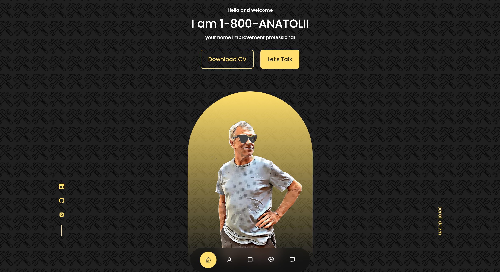

#1-800-Anatolii

### Description :page_with_curl:

This code features a static website page for handyman services using React. Live demo of the project [here](https://call1800anatolii.netlify.app).

#### Screenshots :camera_flash:

#### Technology Used :label: 

* React

#### Resources Used :wrench: 

- [Google Fonts Poppins](https://fonts.google.com/?query=poppins)
- [React Icons](https://react-icons.github.io/react-icons/)
- [Flaticon](https://www.flaticon.com/)
- [Swiper React](https://swiperjs.com/react)
- [EmailJS](https://www.emailjs.com/)
- [Pic Editor](https://www5.lunapic.com/editor/)
- [Cartoonize](https://edit.cartoonize.net/)
- [Img Resize](https://resizing.app/)

#### Installation :electric_plug:

`npm install`
`npm start`
`npm test`
`npm i swiper`

#### Contribution :heavy_plus_sign: 

This code was created with help of [EGATOR's](https://www.youtube.com/channel/UCL8l_VxCAN0jOpaLaRAm8sQ) tutorials . Contributions, issues, and feature requests are welcome. Give :star: if you found this project useful. 

#### Questions :question: 
Feel free to contact me with any questions via email: [:e-mail:](pryadkamaryna@gmail.com).
If you'd like to see my other projects, please visit my [GitHub.](https://github.com/MarynaPR?tab=repositories)